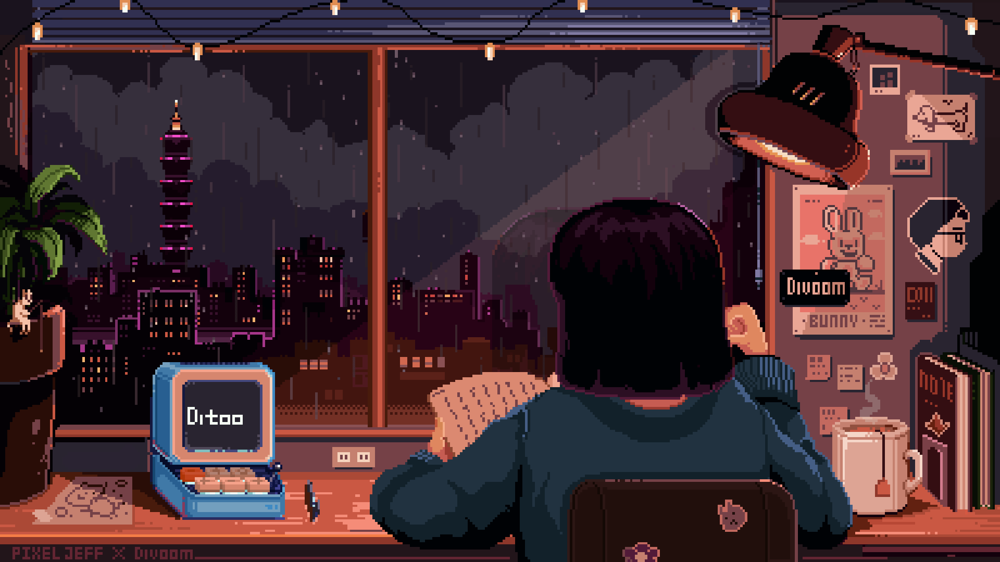

Estudante de Análise e Desenvolvimento de Sistemas na Faculdade de Engenharia de Sorocaba. Atualmente trabalho com Go e estudo Java paralelamente.
Estou constantemente atualizando meus conhecimentos e buscando novos desafios na área de tecnologia. Tenho paixão por aprender e aplicar esses conhecimentos para criar soluções inovadoras.
  
#

<h3 align="left">Connect with me!</h3>

<h3 align="left">My Stack ~</h3>

  
  
  
  
  
  
  

#

#

<picture align="center">
  <source media="(prefers-color-scheme: dark)" srcset="https://raw.githubusercontent.com/mari4souza/mari4souza/output/github-contribution-grid-snake-dark.svg">
  <source media="(prefers-color-scheme: light)" srcset="https://raw.githubusercontent.com/mari4souza/mari4souza/output/github-contribution-grid-snake-dark.svg">
  
</picture>
